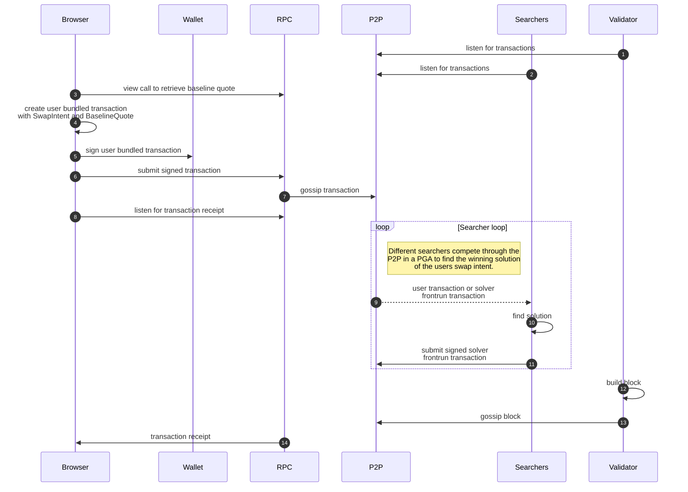
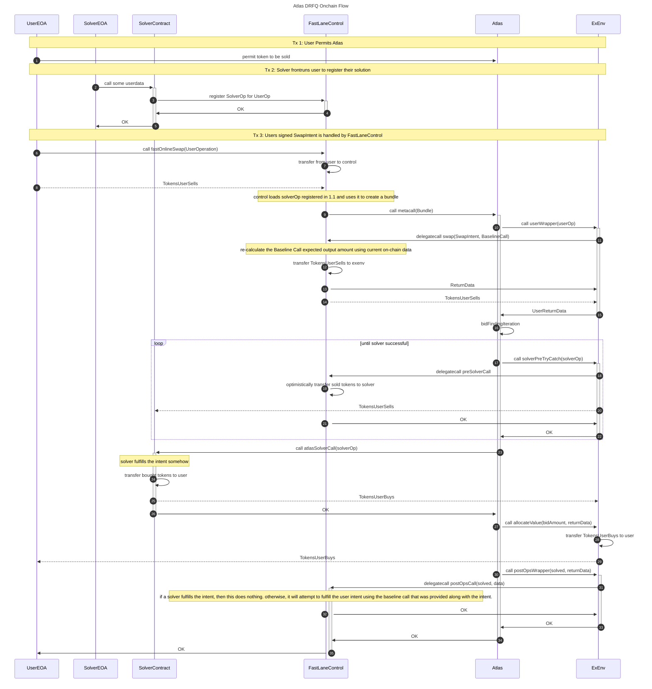
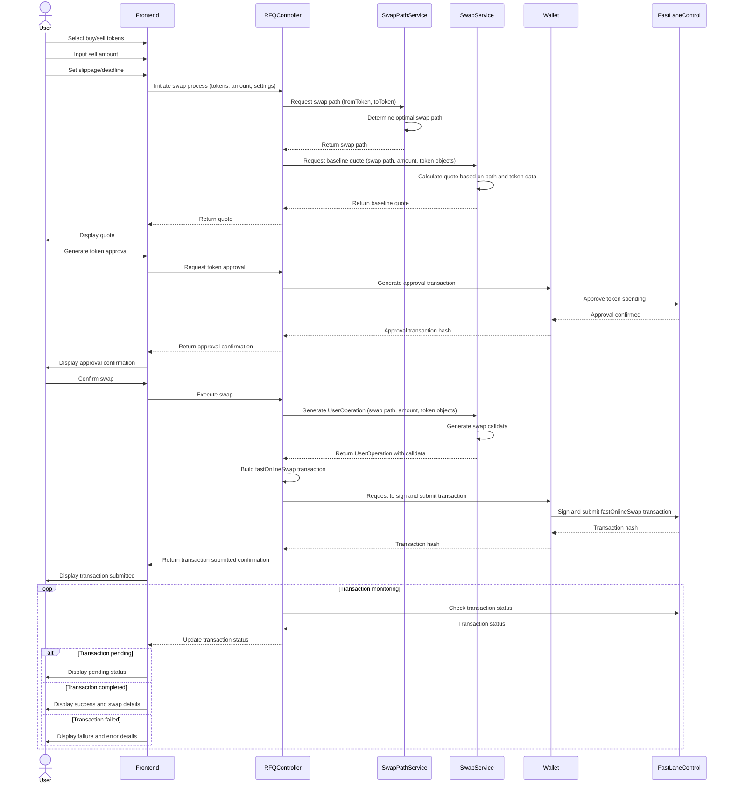
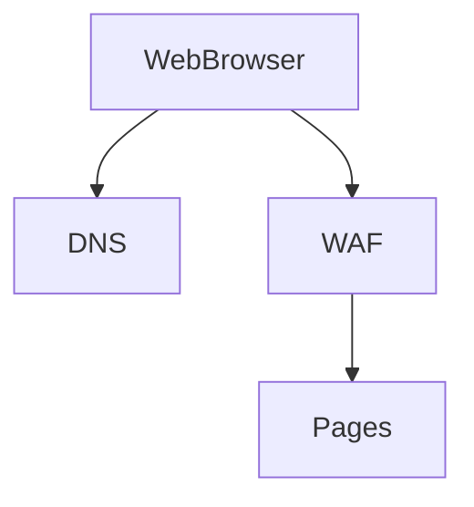
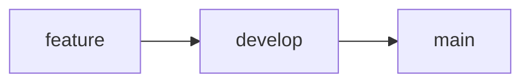
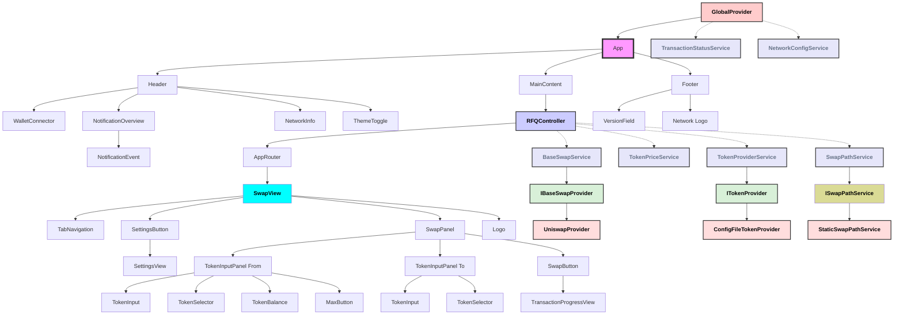

# Atlas DRFQ and Rocketboost Frontend Overview

The Atlas DRFQ module is an implementation of the first on-chain intent-based Request for Quote (RFQ) system, and the Rocketboost frontend (rocketboost.me) is an MIT-open sourced application which provides access to that onchain RFQ. Built with React and the Atlas SDK, this frontend leverages the Atlas Protocol to provide a seamless and efficient token swapping experience on EVM-compatible blockchain networks, starting with Polygon PoS.

## Atlas Protocol

Atlas is a permissionless and modular smart contract framework for Execution Abstraction. It provides applications and frontends with an auction system in which Solvers compete to provide optimal solutions for user intents or MEV redistribution. A User Operation is collected by the app's frontend via the Atlas SDK and sent to an app-designated bundler, which combines it with Solver Operations into a single transaction. The Atlas DRFQ is an implementation of an Atlas "module" which encapsulates application-specific auction logic on top of the core Atlas Protocol. To learn more about Atlas, check out the core repository (https://github.com/FastLane-Labs/atlas) and our alpha documenation (https://fastlane-labs.gitbook.io/atlas-draft). The rest of this document will detail how the Atlas DRFQ module and Rocketboost frontend work, which are both MIT-licensed, unaudited for now (outside of Atlas core) and usable at your own risk and discretion. 

## Key Features

1. **Intent-Based Swaps**: Utilizes Atlas's auction system to find optimal solutions for user swap intents, in this case, with zero dependencies on offchain infra.

2. **Solver Competition**: Leverages multiple Solvers that permissionlessly compete in providing the best execution for user intents. 

3. **User-Friendly Interface**: Intuitive design allowing users to easily input swap intents and execute trades.

4. **Wallet Integration**: Seamless connection with popular Web3 wallets for secure transaction signing and balance management.

5. **Real-Time Quotes**: Fetches and displays up-to-date swap quotes from a fallback router or aggregator, and has solvers compete to offer users price improvement on the swap.

6. **Transaction Monitoring**: Provides real-time updates on the status of ongoing and past transactions.

7. **Responsive Design**: Optimized for both desktop and mobile devices, ensuring a consistent experience across platforms.

8. **Customizable Settings**: Allows users to adjust parameters for personalized trading preferences.

9. **Network Flexibility**: Supports multiple EVM-compatible networks, with clear network information and switching capabilities.

## Architecture Overview

- **Atlas SDK Integration**: Utilizes the Atlas SDK to interact with the Atlas framework for intent creation.
- **Component-Based Structure**: Employs a modular React component architecture for maintainability and reusability.
- **Service Abstraction**: Implements service layers for handling User Operations, Solver interactions, and blockchain communications.
- **State Management**: Employs efficient state management techniques to handle complex application states and data flow.
- **Theming Support**: Includes light and dark mode themes for user comfort in various environments.

This application aims to showcase the power of intent-based trading using the Atlas framework, providing a seamless, efficient, and secure token swapping experience that leverages competition among Solvers to achieve optimal execution for users.

## System Components

### Off Chain Component Interactions

### On-chain Component Interactions

### RFQ Wizard Frontend Flow

## Platform

The DApp will be deployed as a set of static assets on CloudFlare Pages, with no backend dependency other than RPC interaction through a users connected wallet.

### Requirements

- CloudFlare Pages must be configured to block connections from any US citizens using the WAF.

## DevOps

CloudFlare Pages supports the concept of branch based deployments from GitHub, where the app is deployed to a named environment for each branch. We will use a standard [gitflow](https://www.atlassian.com/git/tutorials/comparing-workflows/gitflow-workflow)-like branching model with a `main` and `develop` branch, and feature branches as necessary.

Branching structure will look like:

## React Component Overview

## RocketboostFrontend Service Component Breakdown

### GlobalProvider

Functionality:

- Provides a global state management for the application
- Handles wallet connection and network configuration

Responsibilities:

- Provide a global state management for the application
- Handles wallet connection and network configuration

### RFQController

Functionality:
- Handles user input and settings
- Interacts with the SwapPathService and BaseSwapService
- Submits the swap to the Atlas SDK

Responsibilities:
- Responsible for orchestrating the swap process

### SwapPathService

Functionality:
- Determines swap path between token pairs
- Initially implements static routing through known high-liquidity pairs (WNATIVE/USDC)

Responsibilities:
- Generate swap routes for baseswaps between selected token pairs
- Maintain a list of high-liquidity token pairs for static routing
- Provide route information to other system components
- Handle cases where direct routes are unavailable
- Design for future extensibility to more dynamic routing algorithms

### TransactionStatusService

Functionality:

- Monitors the status of submitted transactions
- Provides access to past transaction statuses
- Registers monitor jobs for newly submitted transactions

Responsibilities:

- Keep track of all user transactions
- Update transaction statuses in real-time
- Persist transaction statuses for historical reference
- Notify other components (e.g., NotificationOverview) of status changes

### BaseSwapService

Functionality:

- Interfaces with specific decentralized exchanges (DEXes) such as Uniswap and Quickswap
- Retrieves baseline quotes for token swaps

Responsibilities:

- Implement the IBaseSwapProvider interface
- Manage connections to different DEX providers (e.g., UniswapV2Provider, UniswapV3Provider, QuickswapProvider)
- Fetch real-time baseline quotes based on user input
- Construct and manage multicall requests for efficient quote retrieval
- Handle quote-related errors and edge cases
- Provide a standardized quote format regardless of the underlying DEX

### TokenPriceService

Functionality:

- Fetches and manages token price data
- Provides up-to-date price information for supported tokens

Responsibilities:

- Regularly update token prices (e.g., every 2-3 minutes)
- Cache price data to reduce API calls
- Convert token amounts to their USD equivalent
- Handle network issues and API failures gracefully

### TokenProviderService

Functionality:

- Manages the list of supported tokens
- Provides token metadata and balance information

Responsibilities:

- Implement the ITokenProvider interface
- Load token list from a configuration file (ConfigFileTokenProvider)
- Fetch token balances for connected wallets
- Provide methods to search and filter tokens
- Keep token metadata (symbol, name, decimals, etc.) up to date

### Atlas SDK Integration

Functionality:

- Integrates the Atlas SDK capabilities into the frontend application
- Manages the core interactions between the frontend and the Atlas framework

Responsibilities:

1. User Operation Creation:
   - Generate user operations based on swap intents input by users
   - Handle necessary signing and validation of user operations

### useWalletConnection Hook

Functionality:

- Manages wallet connections and interactions using a wallet connection library (e.g., wagmi, Web3Modal, or RainbowKit)

Responsibilities:

- Provide a simple interface for connecting and disconnecting wallets
- Expose connected account information and network details
- Handle network switching requests
- Offer methods for transaction signing, including Atlas-specific operations
- Manage wallet connection state

### NetworkConfigService

Functionality:

- Stores and provides access to network-specific configurations for Atlas-RFQ Frontend

Responsibilities:

- Maintain a mapping of supported network configurations, including:
  - Multicall contract addresses
  - Atlas contract addresses
  - Chain IDs
- Provide methods to retrieve configuration details for the current or a specified network
- Update configuration details when necessary (e.g., contract address changes)

Implementation Notes:

- Implemented as a simple service or context provider
- Does not handle network switching or detection (managed by wallet connection library)
- Coordinates with the Atlas SDK to ensure consistent network configurations
